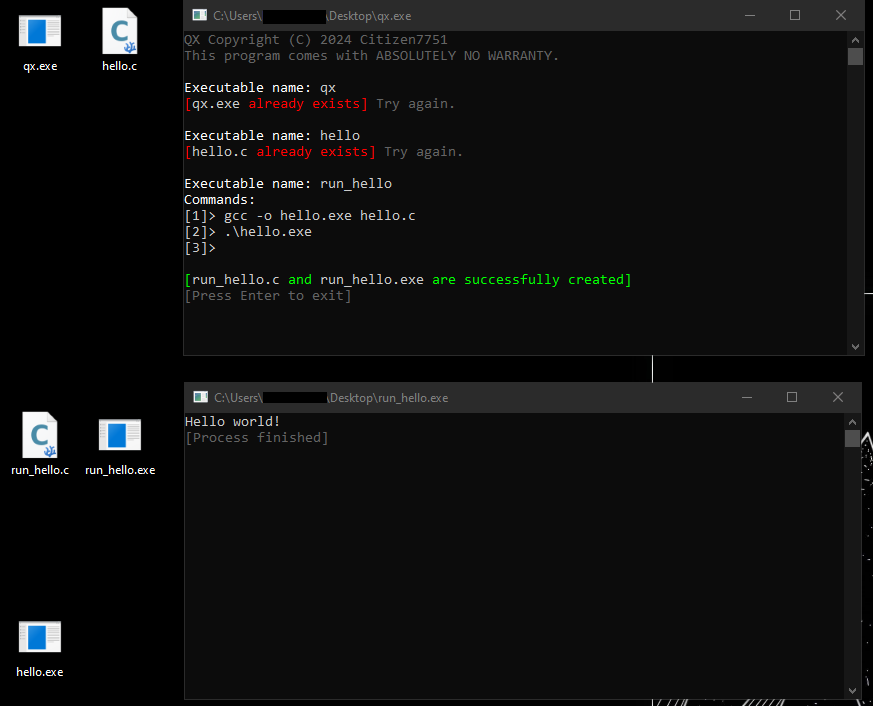

# Quick Execution

It's a simple tool that turns system commands into clickable shortcuts and thus makes execution easier. After you've specified your executable's name and its commands, it will drop a C source file and its compiled version, so it can be executed right away. The reason you get the source file next to the executable is to be able to modify it later and recompile it.



Configurable parts in ```qx.cpp``` are ```def_qx_cc```, ```def_qx_ofile_flag``` and ```def_qx_make_flags```. If you want to change the C compiler it should use, or the flags, modify these. The default configuration is for GCC.

---

## Compile with GCC

**Windows**
```
> g++ -o .\qx.exe .\qx.cpp -s -O3
```

**Linux**
```
$ g++ -o ./qx ./qx.cpp -s -O3
```

---

## License

This software is under the GPLv3 License.
